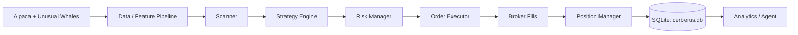

# Cerberus Trading System

> **Runtime status (verified 2026-07-24 — check it yourself, don't trust a static doc).** The Docker Compose `cerberus-trader` service is running in **paper mode** (not real money — `ALPACA_PAPER=true`), currently `restart: always`. The separate macOS launchd agent `com.empire.cerberus.live` has been disabled since 2026-06-05 and stays off unless explicitly re-enabled. Run `docker ps --filter "name=cerberus"` to see current state; see [`docs/RUNBOOK.md`](docs/RUNBOOK.md#check-current-status) for more. Never switch this to `--mode live` (real-money execution) without explicit user instruction.

Cerberus is an intraday algorithmic trading engine for US equities. It supports paper/live modes, multi-strategy signal generation, pre-trade risk checks, execution via Alpaca, and SQLite-backed analytics.

For an in-depth tour of the system, see [`docs/ARCHITECTURE.md`](docs/ARCHITECTURE.md) and [`PRD.md`](PRD.md). AI-agent-facing standards and safety rules live in [`AGENTS.md`](AGENTS.md) / [`CLAUDE.md`](CLAUDE.md).

- Python: `>=3.12`
- Package/deps: `uv` (project is `pyproject.toml`-based)
- Primary entrypoint: `uv run python -m src.main`

## Quick Start

1. Install dependencies:
```bash
uv sync
```
2. Configure environment:
```bash
cp .env.example .env
# Fill in API credentials
```
3. Run health check:
```bash
uv run python -m src.main --healthcheck
```
4. Run paper mode (default; safe — uses gateway executor):
```bash
uv run python -m src.main --mode paper --order-executor gateway
```
5. Safest dry-run (signals + risk checks, no orders submitted):
```bash
uv run python -m src.main --mode paper --order-executor noop --run-once
```

## Runtime Modes

| Mode | Command | Purpose |
|---|---|---|
| Paper loop | `uv run python -m src.main --mode paper` | Continuous paper trading |
| Live loop | `uv run python -m src.main --mode live` | Real execution (high risk) |
| One-shot | `uv run python -m src.main --mode paper --run-once` | Validate startup + initial scan |
| Scheduler | `uv run python -m src.main --scheduler` | Persistent APScheduler process |
| EOD | `uv run python -m src.main --eod` | Run daily aggregation + agent then exit |
| Healthcheck | `uv run python -m src.main --healthcheck` | Validate DB and credentials |

## Architecture

Cerberus follows a vertical-slice pipeline:



## Module Map

| Path | Responsibility |
|---|---|
| `src/main.py` | CLI entrypoint and process orchestration |
| `src/engine/` | Execution, order routing, position/risk management |
| `src/strategies/` | Signal logic (ORB, VWAP, gap, flow, pair, fusion, etc.) |
| `src/scanner/` | Universe selection, ranking, scanner profiles |
| `src/data/` | Alpaca/UW clients, feature pipeline, snapshots |
| `src/backtest/` | Offline replay runner + mock executor |
| `src/analysis/` | DB schema, persistence, reporting |
| `src/analytics/` | Optimization, walk-forward, meta-labeling utilities |
| `src/backtest/fill_models/` | Pluggable fill simulation (fixed BPS, volume-aware) |
| `src/backtest/result_store.py` | JSON result persistence for dashboard API |
| `src/api/` | FastAPI backtest API for EmpireUI dashboard |
| `src/agent/` | Stage-based analysis/tuning/report generation |
| `config/` | Runtime config overlays (`config.yaml`, `risk.yaml`, etc.) |
| `tests/` | Unit/integration/contract/e2e/smoke tests |

## Strategies

`src/main.py` only activates the strategies listed with `enabled: true` in `config/strategies.yaml` (`config/strategies.auto.yaml` can add/override more on top — check both, this list can drift). As of this writing, that's 13:

- `vwap_reversion`
- `orb`
- `index_mean_reversion`
- `flow_momentum`
- `gap_fill`
- `vwap_trend_rider`
- `vix_spike_fade`
- `momentum_continuation`
- `regime_trend_up`
- `regime_bear`
- `regime_adaptive`
- `regime_flat`
- `autoresearch_strategy`

`src/main.py`'s `_build_strategy_registry()` defines several more (`mean_reversion_pro`, `orb_v2`, `pair_trading_v2`, `fusion_v1`, `pair_trading`, `trend_pullback`, `failed_breakout`, and others) that exist in code but are **not** enabled in `config/strategies.yaml`, so they don't currently trade. Archived strategies live under `src/strategies/archived/` and are never registered. See [`docs/CODEBASE_SUMMARY.md`](docs/CODEBASE_SUMMARY.md) for the full breakdown.

## Configuration

Config is merged by `src/core/config.py` from (in order):

- `config/config.yaml`
- `config/strategies.yaml`
- `config/risk.yaml`
- `config/scanner.yaml`
- `config/universe.yaml`
- `config/logging.yaml`
- optional `config/strategies.auto.yaml`
- optional explicit `--config` file/directory override
- env var overrides via `APP_*`

See:
- Architecture: [`docs/ARCHITECTURE.md`](docs/ARCHITECTURE.md)
- Configuration guide: [`docs/CONFIGURATION_GUIDE.md`](docs/CONFIGURATION_GUIDE.md)
- Environment vars: [`docs/environment-variables.md`](docs/environment-variables.md)
- API reference: [`docs/API_REFERENCE.md`](docs/API_REFERENCE.md)
- Deployment: [`docs/DEPLOYMENT.md`](docs/DEPLOYMENT.md)
- Testing: [`TESTING.md`](TESTING.md)
- Runbook: [`docs/RUNBOOK.md`](docs/RUNBOOK.md)
- Codebase index: [`docs/CODEBASE_SUMMARY.md`](docs/CODEBASE_SUMMARY.md)

## Hidden Markov Regime Sidecar

Cerberus now has a dedicated HMM sidecar package under `src/regime_models/hmm/`.

- It is additive, not destructive.
- The current rule-based regime engine stays in place.
- The HMM layer is intended for shadow-mode A/B testing first.
- Default config keeps it off until you explicitly train and enable it.

Core pieces:

- `src/regime_models/hmm/config.py`: nested config for runtime, features, and training
- `src/regime_models/hmm/features.py`: deterministic OHLCV-to-feature preparation
- `src/regime_models/hmm/service.py`: train, predict, and save/load HMM artifacts
- `scripts/bootstrap_hmm_regime.py`: bootstrap a model from CSV or parquet OHLCV

Quick start (`pomegranate` is already a `pyproject.toml` dependency, so `uv sync` is enough — you don't need a separate install for this):

```bash
uv run python scripts/bootstrap_hmm_regime.py --config config/config.yaml --input /path/to/bars.parquet
make test-hmm
```

Artifacts are written under `artifacts/regime_models/hmm/` by default.

## Backtesting

Run backtest:
```bash
uv run python scripts/run_backtest.py --config config/config.yaml --start-date 2024-01-03 --end-date 2024-01-10
```

Offline deterministic replay:
```bash
uv run python scripts/run_backtest.py --config config/config.yaml --start-date 2024-01-03 --end-date 2024-01-10 --offline-bars-dir /path/to/jsonl_bars
```

### Realism Controls

- **Pluggable fill models**: Choose between fixed-BPS slippage or volume-aware market impact via `backtest.fill_model` config (`fixed` or `volume_aware`)
- **Per-strategy overnight handling**: Configure `allow_overnight`, `max_hold_days`, and `overnight_stop_mult` per strategy instead of global EOD flattening
- **Data quality checks**: Pre-backtest validation for gaps, zero-volume bars, price outliers, and stale prices. Enable via `analytics.data_quality` in config

### Post-Backtest Analytics

- **Benchmark comparison**: Alpha, beta, information ratio, up/down capture ratios vs SPY
- **Monte Carlo simulation**: Bootstrap resampling for probability of loss/ruin, equity confidence intervals, Sharpe distribution. Enable via `analytics.monte_carlo.enabled: true`
- **Diagnostics engine**: Strategy ranking, regime mismatch detection, time-of-day edge analysis, hold/exit analysis. Enable via `analytics.diagnostics.enabled: true`
- **Parameter sensitivity**: Spearman rank correlation analysis of Optuna trial params vs objective scores (auto-runs after WFO)

### Results API

Backtest results are persisted as JSON and served via FastAPI:
```bash
uv run uvicorn src.api.backtest_api:app --port 8002
```

Endpoints: `/api/backtest/runs`, `/api/backtest/runs/{id}/equity`, `/api/backtest/runs/{id}/trades`, `/api/backtest/runs/{id}/monte-carlo`, `/api/backtest/runs/{id}/regime-splits`

## Development

Common commands:

```bash
make test
make test-ci
make test-unit
make test-integration
make test-contract
make test-e2e
make lint
make type-check
make security
```

## Docker

Build:
```bash
docker build -t empire/cerberus:latest .
```

Run paper trader (this also brings up the `cerberus-snapshot` sidecar, which exports SQLite state from the Docker volume to `./state_export` on the host):
```bash
docker compose up -d cerberus-trader
```

Run scheduler profile (off by default — only starts if you explicitly ask for it):
```bash
docker compose --profile scheduler up -d cerberus-scheduler
```

See [`docs/DEPLOYMENT.md`](docs/DEPLOYMENT.md) for day-to-day Docker operation and [`docs/RUNBOOK.md`](docs/RUNBOOK.md) for checking current status/incident response.

## Operations and Safety

- Default safety: use paper mode until explicitly ready for live mode.
- Validate runtime with `--healthcheck` before market hours.
- Review operational procedures in [`docs/RUNBOOK.md`](docs/RUNBOOK.md).
- Security policy in [`SECURITY.md`](SECURITY.md).
- Testing conventions in [`TESTING.md`](TESTING.md).
