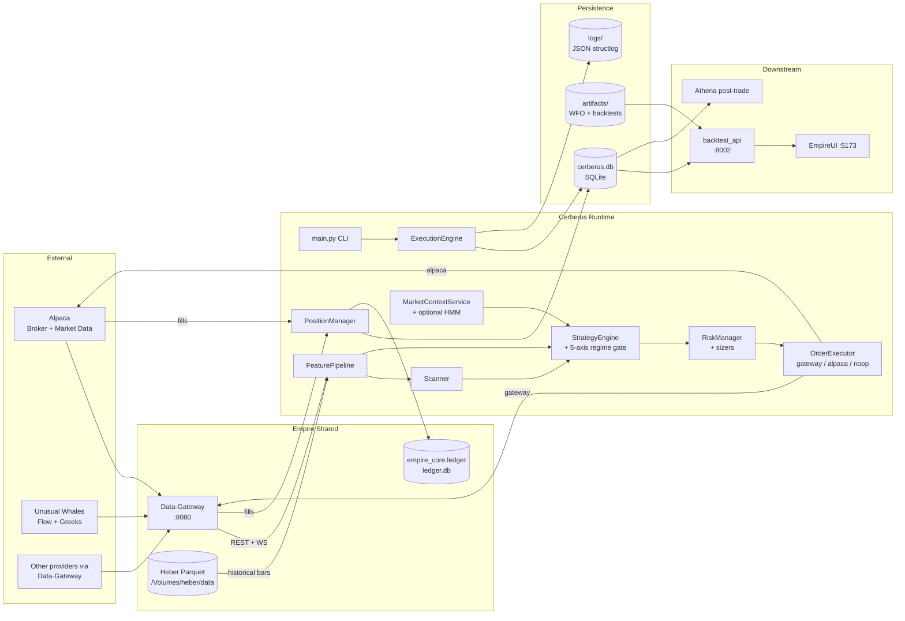
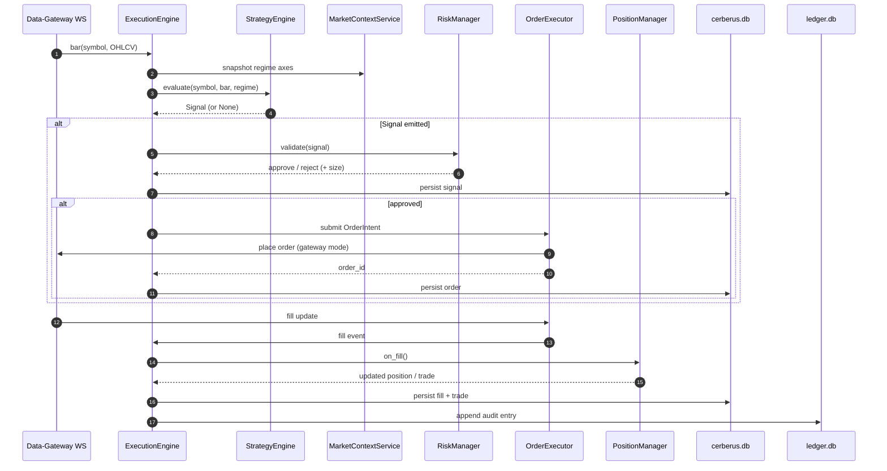
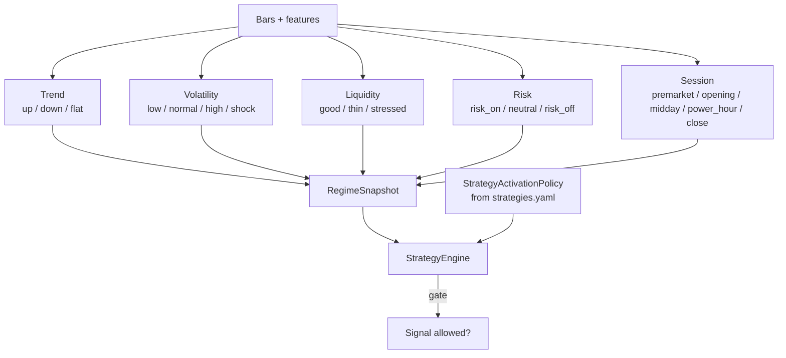
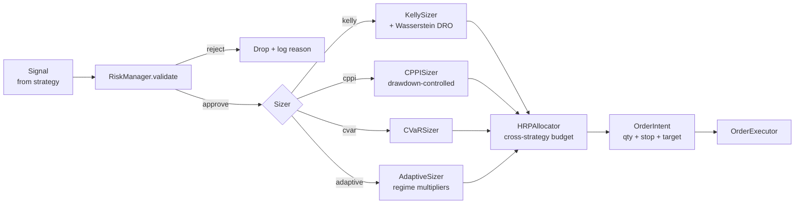
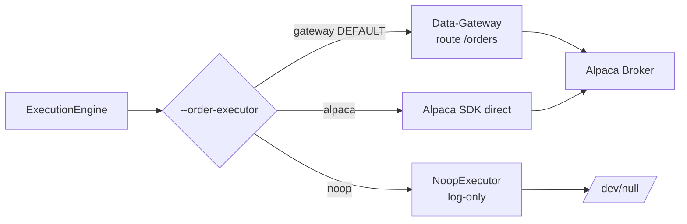
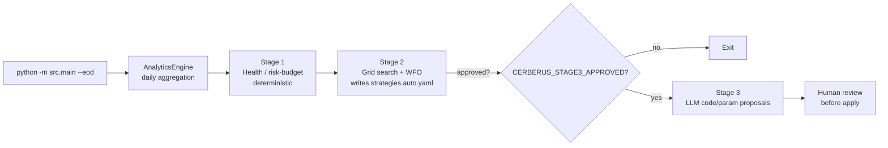
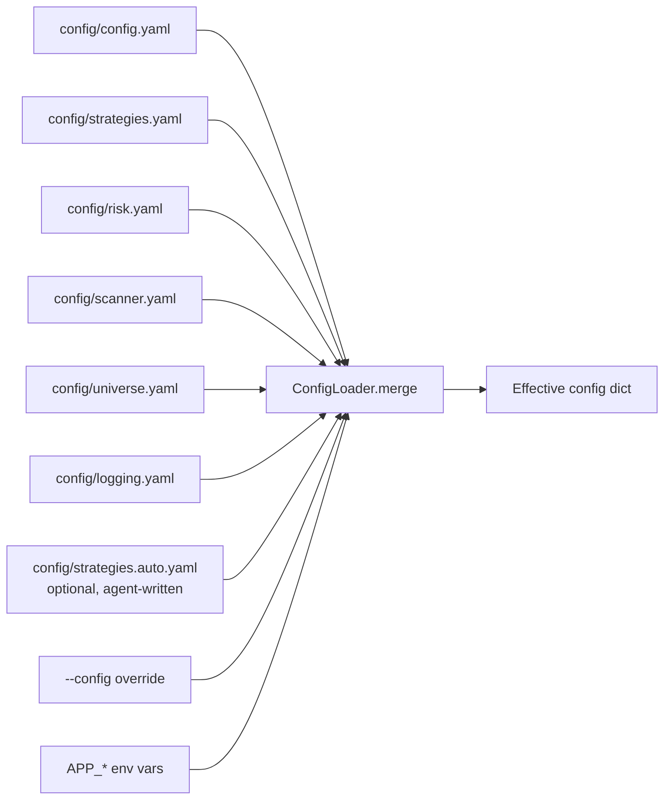
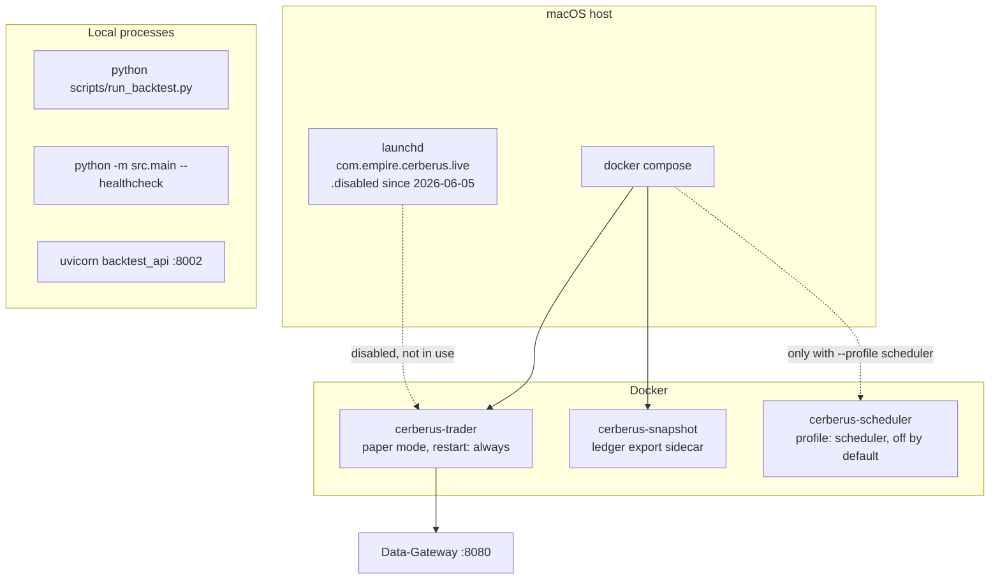

# Architecture

Cerberus is an event-driven, intraday multi-strategy trading system for US equities. It runs a vertical-slice pipeline from market data through strategy signals, risk gating, order execution, and analytics persistence.

> **Runtime status (verified 2026-07-24).** The `cerberus-trader` Docker container is running in **paper mode** (`--mode paper --order-executor gateway`, `ALPACA_PAPER=true`) — it is not stopped. Its Docker healthcheck flapped between `healthy` and `unhealthy` during this check; if you see `unhealthy`, check `docker logs cerberus_trader` before assuming an outage. Separately, the standalone macOS launchd agent `com.empire.cerberus.live` has been disabled since 2026-06-05 (renamed to `com.empire.cerberus.live.plist.disabled.20260605-user-request`) — that is a different run path than the Docker container and stays off unless the user re-enables it. See [`RUNBOOK.md`](RUNBOOK.md) for how to check current status yourself, and [`DEPLOYMENT.md`](DEPLOYMENT.md) for the full deploy topology.

## High-Level Topology



## Runtime Sequence



## Key Modules

| Module | Path | Notes |
|---|---|---|
| Entrypoint | `src/main.py` | CLI args, dependency wiring, run loop, `_build_strategy_registry()` |
| Execution | `src/engine/execution.py` | Main orchestrator and trading lifecycle |
| Risk | `src/engine/risk.py` | Position sizing + guardrails |
| Orders | `src/engine/orders.py` | Alpaca / gateway / noop execution adapters |
| Positions | `src/engine/position_manager.py` | Position state + realized/unrealized PnL |
| Scanner | `src/scanner/core.py` | Candidate filtering/ranking/watchlist refresh |
| Regime | `src/analysis/regime.py` | `MarketContextService` — 5-axis classifier |
| Strategies | `src/strategies/` | Strategy implementations + config models |
| Data | `src/data/` | Alpaca/UW/Heber clients + feature calculation |
| Backtest | `src/backtest/` | Replay runner and deterministic mock execution |
| Analysis | `src/analysis/` | SQLAlchemy models and persistence (`db.py`) |
| Analytics | `src/analytics/` | WFO/Optuna harness, Monte Carlo, diagnostics, meta-labeling |
| Agent | `src/agent/` | Stage-based analytics/tuning/reporting |
| API | `src/api/` | FastAPI backtest results API (port 8002) |

## 5-Axis Regime Gate

`MarketContextService` (`src/analysis/regime.py`) classifies the market across five orthogonal axes, each computed independently from rolling features:



Each strategy declares its activation policy in `config/strategies.yaml`:

```yaml
strategies:
  vwap_reversion:
    activation:
      trend: [flat, down]
      vol: [normal, high]
      liquidity: [good]
      session: [midday, power_hour]
```

`StrategyEngine.gate_signal()` blocks any signal whose current regime tuple is not in the strategy's allowed cross-product. **Note:** as of May 2026 (`chore(activation): remove risk axis from all production activation blocks`), no strategy in `config/strategies.yaml` gates on the `risk` axis — the underlying 5-day-return risk classifier scored below a constant-`RISK_ON` baseline against SPY ground truth, so gating on it was removed repo-wide rather than shipping an unvalidated signal. The `risk` axis is still computed and logged; it's just not used to allow/block strategies today. See the CHANGELOG for the retirement rationale.

### Optional HMM Sidecar

`src/regime_models/hmm/` is an additive HMM-based regime detector (pomegranate). It can run in `shadow` mode (computed alongside rules, logged for A/B comparison) or `primary` mode (overrides the rule-based label). Default: off. Bootstrap with `scripts/bootstrap_hmm_regime.py`.

## Risk and Sizing Pipeline



Hard ceilings enforced in `RiskManager`, sourced from `config/risk.yaml` (verified against the file directly):

| Setting | Default | Effect |
|---|---|---|
| `max_daily_loss` | 500.0 USD | Halt new entries on breach |
| `max_risk_per_trade` | 50.0 USD | Reject signal if (entry − stop) × qty > cap |
| `max_open_risk` | 200.0 USD | Total open risk cap |
| `max_open_positions` | 5 | Concurrent positions cap |
| `max_positions_per_strategy` | 3 | Per-strategy concurrency cap |
| `max_trades_per_day` | 20 | Daily entry cap |
| `max_notional_per_order` | 5000.0 USD | Per-order notional cap |
| `max_notional_per_symbol` | 5000.0 USD | Per-symbol exposure cap |

## Order Executors



`noop` is the safest mode — it generates signals, runs risk checks, and writes the would-be order to the DB, but submits nothing to a broker.

## Backtest & Analytics Architecture

The backtest engine uses a layered composition pattern with pluggable modules:

```mermaid
flowchart TB
    subgraph BT[Backtest Engine]
        RUNNER[Runner\nscripts/run_backtest.py] --> DQ[DataQualityChecker]
        RUNNER --> SIM[SimulatedOrderExecutor]
        SIM --> FM{FillModel}
        FM --> FIXED[FixedSlippage\nBPS]
        FM --> VOL[VolumeAware\nmarket impact]
        RUNNER --> EOD[Per-strategy EOD\nallow_overnight, max_hold_days]
    end
    subgraph POST[Post-Backtest]
        RUNNER --> BENCH[Benchmark vs SPY\nalpha, beta, IR, capture]
        RUNNER --> MC[Monte Carlo bootstrap\nP(loss), Sharpe CI]
        RUNNER --> DIAG[Diagnostics\nstrategy ranking,\nregime mismatches]
        RUNNER --> REPORT[BacktestReportCard]
        REPORT --> STORE[result_store JSON]
    end
    subgraph WFO[Walk-Forward Optimization]
        OPT[Optuna harness\nscripts/run_wfo.py] --> HOLDOUT[Holdout validation]
        OPT --> SENS[Parameter sensitivity\nSpearman]
    end
    STORE --> API[backtest_api :8002]
    API --> UI[EmpireUI :5173]
```

| Module | Path | Purpose |
|---|---|---|
| Fill models | `src/backtest/fill_models/` | Pluggable slippage simulation (fixed BPS, volume-aware) |
| Data quality | `src/backtest/data_quality.py` | Gap / zero-vol / outlier checks pre-run |
| Result store | `src/backtest/result_store.py` | JSON persistence for backtest results |
| Benchmark | `src/analytics/benchmark.py` | Alpha, beta, information ratio, capture ratios vs SPY |
| Monte Carlo | `src/analytics/monte_carlo.py` | Bootstrap resampling for confidence intervals |
| Diagnostics | `src/analytics/diagnostics.py` | Strategy ranking, regime mismatch, time-of-day edge |
| Param sensitivity | `src/analytics/param_sensitivity.py` | Spearman rank correlation of Optuna trial params vs objective |
| Backtest API | `src/api/backtest_api.py` | FastAPI endpoints for EmpireUI dashboard |

## EOD Agent Pipeline



## Configuration Architecture

`ConfigLoader` in `src/core/config.py` merges config in this order:



Runtime environment variables (credentials, aliases, optional toggles) are documented in [`environment-variables.md`](environment-variables.md) and [`CONFIGURATION_GUIDE.md`](CONFIGURATION_GUIDE.md).

## Position in the Empire Monorepo

```
External APIs (Alpaca, UnusualWhales, ...)
        ↓
   Data-Gateway (port 8080, normalized REST/WS)
        ↓
   Cerberus  ──→  Alpaca broker (orders)
        ↓
   cerberus.db + ledger.db
        ↓
   EmpireUI (port 5173) ← backtest_api (port 8002)
        ↓
   Athena (post-trade LLM analyst)
```

Cerberus consumes from Data-Gateway and Heber (historical parquet via `src/data/heber_read_client.py`), writes its own SQLite stores, and surfaces backtest/WFO artifacts to EmpireUI. Post-trade narrative analysis is handled downstream by Athena.

## Deployment Topology



See [`DEPLOYMENT.md`](DEPLOYMENT.md) for day-to-day Docker/launchd commands, `docker-compose.yml`, and `Dockerfile` for full runtime packaging details.

## Related Docs

- [`../PRD.md`](../PRD.md) — original product requirements (large, historical, includes the multi-axis regime upgrade patch)
- [`CODEBASE_SUMMARY.md`](CODEBASE_SUMMARY.md) — package-by-package index
- [`CONFIGURATION_GUIDE.md`](CONFIGURATION_GUIDE.md) — full config/env matrix
- [`DEPLOYMENT.md`](DEPLOYMENT.md) — Docker, launchd, scheduler details
- [`RUNBOOK.md`](RUNBOOK.md) — operational incidents
- [`API_REFERENCE.md`](API_REFERENCE.md) — backtest FastAPI endpoints
