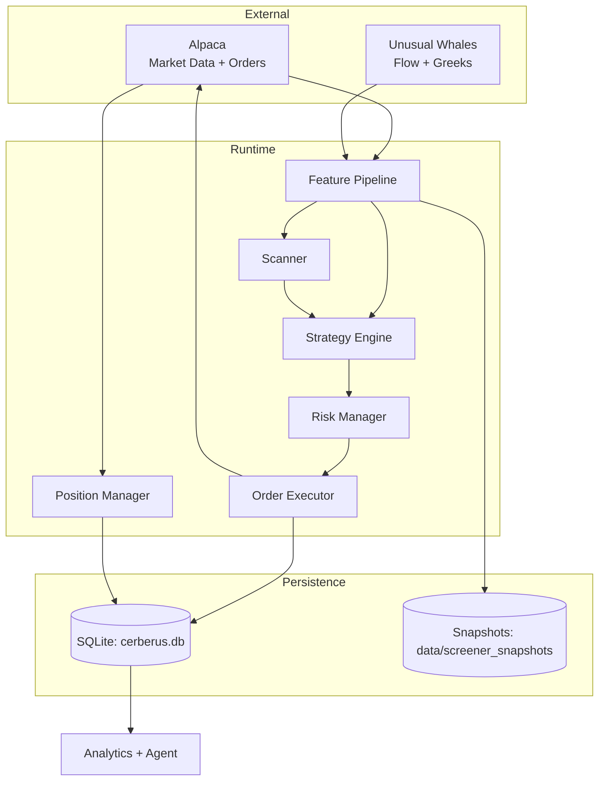
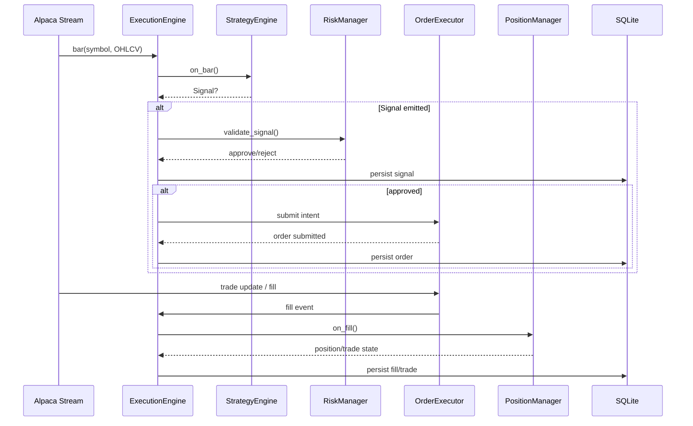
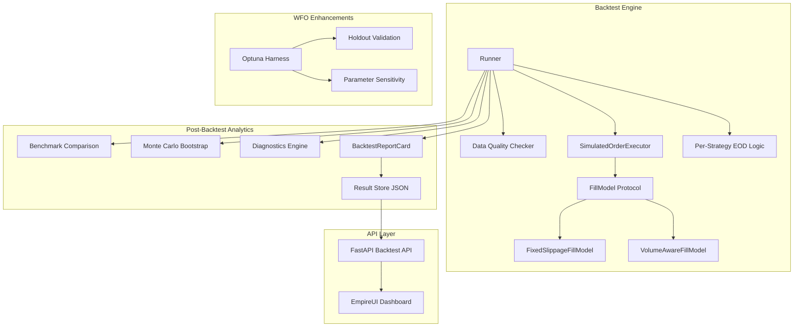

# System Architecture

Cerberus is an event-driven intraday trading system with a vertical-slice flow from market data to strategy signals, risk gating, execution, and analytics persistence.

## System Overview

## Runtime Flow

## Key Modules

| Module | Path | Notes |
|---|---|---|
| Entrypoint | `src/main.py` | CLI args, dependency wiring, run loop |
| Execution | `src/engine/execution.py` | Main orchestrator and trading lifecycle |
| Risk | `src/engine/risk.py` | Position sizing + guardrails |
| Orders | `src/engine/orders.py` | Broker/noop execution adapters |
| Positions | `src/engine/position_manager.py` | Position state + realized/unrealized PnL |
| Scanner | `src/scanner/core.py` | Candidate filtering/ranking/watchlist refresh |
| Strategies | `src/strategies/` | Strategy implementations + config models |
| Data | `src/data/` | Alpaca/UW clients + feature calculation |
| Backtest | `src/backtest/` | Replay runner and deterministic mock execution |
| Analysis | `src/analysis/` | SQLAlchemy models and persistence |
| Agent | `src/agent/` | Stage-based analytics/tuning/reporting |

## Configuration Architecture

`ConfigLoader` in `src/core/config.py` merges config in this order:

1. `config/config.yaml`
2. `config/strategies.yaml`
3. `config/risk.yaml`
4. `config/scanner.yaml`
5. `config/universe.yaml`
6. `config/logging.yaml`
7. optional `config/strategies.auto.yaml`
8. optional `--config` override file/directory
9. env var overrides via `APP_*`

Runtime environment variables (credentials, aliases, optional toggles) are documented in [`docs/environment-variables.md`](environment-variables.md).

## Multi-Axis Regime Model

Cerberus supports both legacy regime (`bull|bear|chop`) and multi-axis regime snapshots:

- `trend`: `up|down|flat`
- `vol`: `low|normal|high|shock`
- `liquidity`: `good|thin|stressed`
- `risk`: `risk_on|neutral|risk_off`
- `session`: `premarket|opening|midday|power_hour|close`

These are carried through signal/trade metadata for routing and analytics.

## Backtest & Analytics Architecture

The backtest engine uses a layered composition pattern with pluggable modules:

| Module | Path | Purpose |
|---|---|---|
| Fill Models | `src/backtest/fill_models/` | Pluggable slippage simulation (fixed BPS, volume-aware) |
| Data Quality | `src/backtest/data_quality.py` | Pre-backtest bar validation and symbol exclusion |
| Benchmark | `src/analytics/benchmark.py` | Alpha, beta, information ratio, capture ratios vs SPY |
| Monte Carlo | `src/analytics/monte_carlo.py` | Bootstrap P&L resampling for confidence intervals |
| Diagnostics | `src/analytics/diagnostics.py` | Strategy ranking, regime mismatches, time-of-day edge |
| Param Sensitivity | `src/analytics/param_sensitivity.py` | Spearman rank correlation of WFO trial params |
| Result Store | `src/backtest/result_store.py` | JSON persistence for backtest results |
| Backtest API | `src/api/backtest_api.py` | FastAPI endpoints for EmpireUI dashboard |

## Deployment Topology

- Local Python process: `python -m src.main ...`
- Docker service `cerberus-trader` (paper loop)
- Docker service `cerberus-scheduler` (optional APScheduler process)

See `docker-compose.yml` and `Dockerfile` for runtime packaging details.
