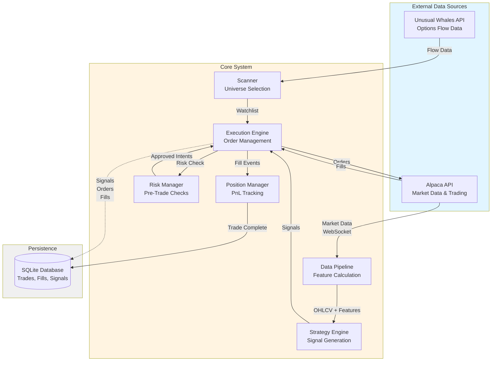
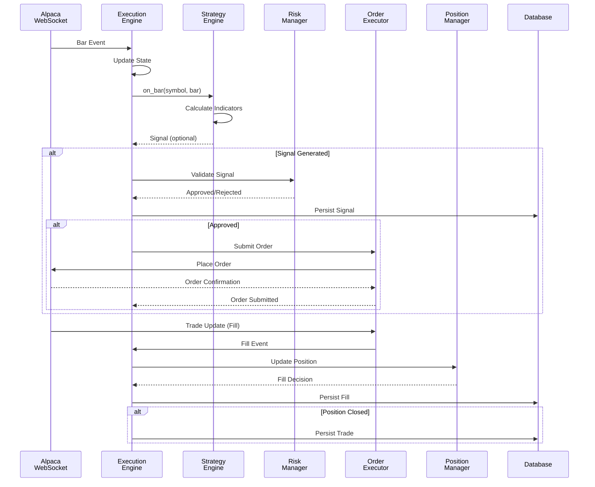
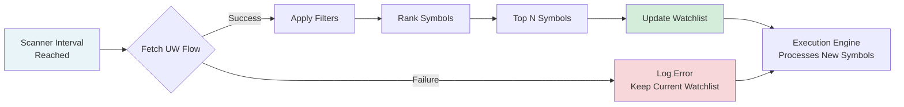
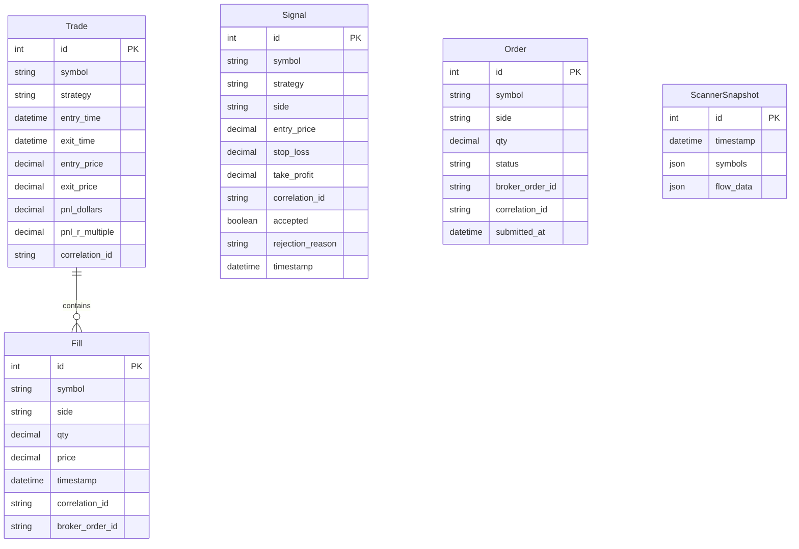

# System Architecture

Comprehensive architecture overview of the Cerberus intraday trading system.

## Table of Contents

- [High-Level Architecture](#high-level-architecture)
- [Core Components](#core-components)
- [Data Flows](#data-flows)
- [External Integrations](#external-integrations)
- [Persistence Layer](#persistence-layer)

---

## High-Level Architecture

Cerberus follows a **pipeline architecture** with clear separation between data acquisition, strategy logic, execution, and analytics.

---

## Core Components

### ExecutionEngine
**Location**: [`src/engine/execution.py`](file:///Users/jacobmcmillan/Empire/Cerberus/src/engine/execution.py)

Central orchestrator managing the main trading loop:
- Receives bars from Alpaca WebSocket
- Routes bars to strategies for signal generation
- Processes signals through risk checks
- Manages watchlist based on scanner results
- Coordinates position and order management

**Key Responsibilities**:
- Bar-by-bar event processing
- Signal routing and validation
- Watchlist management
- End-of-day position flattening

### PositionManager
**Location**: [`src/engine/position_manager.py`](file:///Users/jacobmcmillan/Empire/Cerberus/src/engine/position_manager.py)

Maintains position state and calculates PnL:
- Processes fill events to update positions
- Calculates realized/unrealized PnL
- Evaluates exit conditions (stops, targets, time)
- Tracks MAE (Maximum Adverse Excursion) and MFE (Maximum Favorable Excursion)

**Key Concept**: Source of truth for all position state (PRD 6.7)

### RiskManager
**Location**: [`src/engine/risk.py`](file:///Users/jacobmcmillan/Empire/Cerberus/src/engine/risk.py)

Pre-trade risk validation:
- Position limit enforcement
- Daily loss limit checks
- Position sizing based on ATR
- Correlation-based exposure limits

**Decision**: Accepts or rejects signals before order submission

### OrderExecutor
**Location**: [`src/engine/orders.py`](file:///Users/jacobmcmillan/Empire/Cerberus/src/engine/orders.py)

Broker API interaction:
- Submits orders to Alpaca
- Cancels orders
- Processes trade updates from WebSocket
- Maps broker order IDs to correlation IDs

### Scanner
**Location**: [`src/scanner/core.py`](file:///Users/jacobmcmillan/Empire/Cerberus/src/scanner/core.py)

Dynamic universe selection:
- Fetches unusual options flow from Unusual Whales
- Applies tradability filters (volume, price, volatility)
- Ranks symbols by flow strength
- Returns top N symbols for watchlist

**Refresh**: Periodic (every N bars, configurable)

### StrategyEngine
**Location**: [`src/engine/strategy_engine.py`](file:///Users/jacobmcmillan/Empire/Cerberus/src/engine/strategy_engine.py)

Strategy coordination:
- Registers strategies at startup
- Routes bars to appropriate strategies based on regime
- Collects signals from all active strategies

---

## Data Flows

### Real-Time Trading Flow

### Scanner Integration Flow

---

## External Integrations

### Alpaca API
**Purpose**: Market data and trade execution

**Endpoints Used**:
- **WebSocket**: Real-time bars and trade updates
- **REST**: Historical data, account info, order management

**Authentication**: API key + secret (environment variables)

**Rate Limits**: 200 requests/minute (REST)

### Unusual Whales API
**Purpose**: Options flow data for scanner

**Endpoints Used**:
- `/api/stock/flow`: Unusual options activity

**Authentication**: API key (environment variable)

**Rate Limits**: Varies by subscription tier

---

## Persistence Layer

### Database Schema

### Database Technology

**Engine**: SQLite  
**Location**: `cerberus.db` (root directory)  
**Fault Tolerance**: PRD 11.4 (buffered writes, configurable fail modes)

**Tables**:
- **Trade**: Completed round-trip trades
- **Fill**: Individual fill events from broker
- **Signal**: All signals (accepted + rejected)
- **Order**: Order lifecycle tracking
- **ScannerSnapshot**: Historical watchlist snapshots

---

## Key Design Principles

### 1. Intraday-Only Positions
All positions closed by 16:00 ET (configurable). No overnight holdings.

### 2. Correlation ID Tracking
Every signal → order → fill → trade tracked via `correlation_id` for end-to-end observability (PRD 2.1, 3.2).

### 3. Best-Effort Observability
Database writes and logging are best-effort. Trading decisions never blocked by DB failures (PRD 11.2, 11.4).

### 4. Multi-Axis Regime System
Strategy activation determined by 5 orthogonal axes (not a single BULL/BEAR/CHOP label):
- **Trend**: UP/DOWN/FLAT (SPY cumulative return)
- **Volatility**: LOW/NORMAL/HIGH/SHOCK (realized vol z-score)
- **Liquidity**: GOOD/THIN/STRESSED (dollar volume / range)
- **Risk**: RISK_ON/NEUTRAL/RISK_OFF (VXX momentum)
- **Session**: OPENING/MIDDAY/POWER_HOUR/CLOSE (time-of-day)

Each strategy defines an `ActivationPolicy` specifying which axis states permit trading.

### 5. Source of Truth
PositionManager is the single source of truth for all position state. Broker state reconciled periodically but local state takes precedence for decisions (PRD 6.7).

---

## Related Documentation

- [Order Execution Flow](file:///Users/jacobmcmillan/Empire/Cerberus/docs/order_flow.md) - Detailed signal-to-trade workflow
- [Strategy Development Guide](file:///Users/jacobmcmillan/Empire/Cerberus/docs/strategy_guide.md) - How to create custom strategies
- [README](file:///Users/jacobmcmillan/Empire/Cerberus/README.md) - Setup and getting started
- [Runbook](file:///Users/jacobmcmillan/Empire/Cerberus/docs/runbook.md) - Operational procedures
