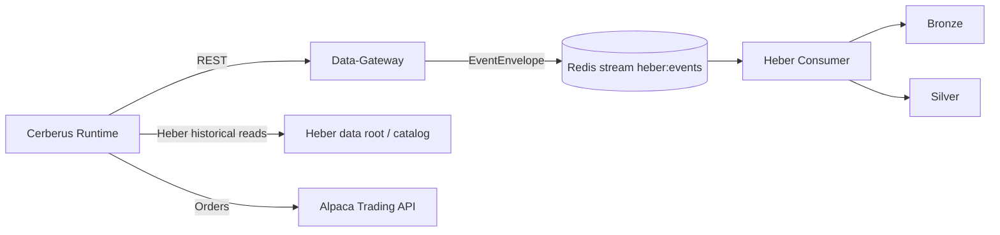

# Cerberus + Data-Gateway + Heber Integration Architecture

## Goal
Use a controlled migration path where:
- Data-Gateway becomes the default source for market/flow reads.
- Heber becomes the default point-in-time-safe historical read store.
- Cerberus keeps ownership of strategy, risk, and execution.

This document is scoped to Cerberus code truth and marks external repo items as dependencies.

## Current Cerberus Implementation (Code-Verified)

### Runtime mode controls
Configured in `/Users/jacobmcmillan/Empire/Cerberus/src/core/settings.py`:
- `CERBERUS_DATA_BACKEND=legacy|gateway|dual`
- `CERBERUS_STORAGE_BACKEND=sqlite|heber|dual`
- `CERBERUS_FAILOVER_TO_LEGACY=true|false`
- `CERBERUS_DUAL_READ_COMPARE=true|false`

### Read-path routing in Cerberus
Implemented in `/Users/jacobmcmillan/Empire/Cerberus/src/data/fetcher.py`:
- `legacy`: reads via direct provider clients (`AlpacaClient`, `UnusualWhalesClient`).
- `gateway`: reads via `CentralApiClient`.
- `dual`: reads via gateway + parity diagnostics against legacy.
- `heber` storage mode: first tries `HeberReadClient`, then falls back to gateway/legacy according to flags.

### Gateway routes currently used by Cerberus
Implemented in `/Users/jacobmcmillan/Empire/Cerberus/src/data/api_client.py`:
- `GET /api/v1/alpaca/stocks/{symbol}/bars`
- `GET /api/v1/alpaca/stocks/{symbol}/trades`
- `GET /api/v1/alpaca/screener/most-actives`
- `GET /api/v1/alpaca/screener/movers`
- `GET /api/v1/uw/flow/{symbol}`
- `GET /api/v1/uw/gex/{symbol}`

Notes:
- Auth header: `X-Gateway-Key`.
- Cerberus has retry controls for transport errors and `429/5xx`.
- Quotes/snapshot endpoints are not currently wired in `CentralApiClient` for Cerberus runtime paths.

### Heber read behavior currently used by Cerberus
Implemented in `/Users/jacobmcmillan/Empire/Cerberus/src/data/heber_read_client.py`:
- Reads parquet from local Heber silver path (`CERBERUS_HEBER_DATA_ROOT`).
- Applies anti-leakage filter with `ts_available <= as_of`.
- Normalizes bars/trades into Cerberus-compatible shapes.

This means current Cerberus Heber integration is file/catalog-root based, not direct SDK `read_asof/asof_join` calls.

### Health checks currently implemented
Implemented in `/Users/jacobmcmillan/Empire/Cerberus/src/core/health.py`:
- Gateway connectivity probe (`/health/ready`).
- Heber catalog connectivity probe.
- Heber freshness probe using latest parquet file age for required feeds.

## Target Future State (Planned)

### Cerberus
- Uses Data-Gateway as primary market/flow source in live runtime.
- Uses Heber as primary historical/replay source.
- Keeps order submission and trade lifecycle in Cerberus.

### Data-Gateway (dependency)
- Owns provider auth/rate-limit/cache/normalization.
- Optionally fans out normalized envelopes to Redis stream for Heber ingestion.

### Heber (dependency)
- Owns Bronze/Silver durability and schema governance.
- Provides point-in-time-safe read APIs at scale.

## Boundary Ownership

### Cerberus owns
- Strategy/risk/execution and decision logic.
- Runtime orchestration and mode switching.
- Trade persistence and analytics outputs in Cerberus context.

### Data-Gateway owns
- Provider connectivity, auth, retries, and normalization.
- Stream fanout when enabled.

### Heber owns
- Durable data storage and dataset contracts.
- Consumer/write reliability and DLQ behavior.

## Target Flow

## Interface Contracts

### Cerberus -> Data-Gateway
- Header: `X-Gateway-Key`.
- Base URL: `CERBERUS_GATEWAY_URL`.
- Runtime timeout/retries:
  - `CERBERUS_GATEWAY_TIMEOUT_SECONDS`
  - `CERBERUS_GATEWAY_MAX_RETRIES`
  - `CERBERUS_GATEWAY_RETRY_BACKOFF_SECONDS`

### Cerberus -> Heber (current)
- Local/catalog-backed read path through `HeberReadClient`.
- Required anti-leakage constraint: `ts_available <= as_of`.

### Cerberus -> Heber (future option)
- Direct SDK `read_asof/asof_join` usage can be adopted later.
- Not currently the active Cerberus implementation.

## Canonical Data Rules
- Instrument identity remains canonical (`instrument_key` style from Gateway contracts).
- Time fields:
  - `ts_event`: source event time.
  - `ts_ingest`: ingest processing time.
  - `ts_available`: safe read barrier for point-in-time correctness.

## Failure Modes and Controls

1. Gateway auth/config errors (`401/403`)
- Fail startup validation in gateway/dual mode when key/url missing.

2. Gateway degradation (`429/5xx`, transport failures)
- Apply retries with backoff.
- Fail over to legacy only when `CERBERUS_FAILOVER_TO_LEGACY=true`.

3. Heber read unavailable or stale
- Health and freshness checks report degraded/error.
- Fetcher falls back to gateway/legacy based on mode and failover.

4. Dual parity drift
- Dual mode emits parity diagnostics for bars/trades/flow/gex.
- Used for migration confidence, not direct control-flow blocking.

## Observability (Cerberus side)
- Startup mode validation errors (`validate_startup_mode`).
- Gateway and Heber health probes.
- Heber freshness checks on required feeds.
- Dual-read parity logs in fetcher for migration monitoring.

## Security and Access
- During/after cutover, Cerberus should only need:
  - Gateway key for Data-Gateway calls.
  - Heber catalog/data-root access for historical reads.
- Provider keys in Cerberus should be retained only while legacy/failover paths are still active.

## Non-Goals
- No change to Cerberus order execution ownership.
- No strategy logic rewrite in this migration doc.
- No mandatory immediate replacement of SQLite trade journal.
