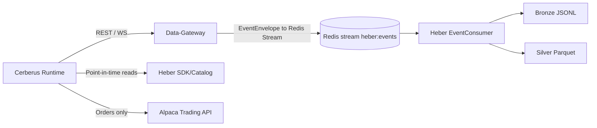

# Cerberus + Data-Gateway + Heber Integration Architecture

## Goal
Replace Cerberus direct market-data/storage paths with:
- Data-Gateway for provider access, normalization, auth, rate limiting, and stream fanout.
- Heber for Bronze/Silver/Gold storage and point-in-time-safe reads.

This is an implementation-focused target architecture for the current codebases in:
- `/Users/jacobmcmillan/Empire/Cerberus`
- `/Users/jacobmcmillan/Empire/Data-Gateway`
- `/Users/jacobmcmillan/Empire/Heber`

## Current State (Important Facts)
- Cerberus runtime still pulls data directly from provider SDK/HTTP clients in:
  - `src/data/alpaca.py`
  - `src/data/unusual_whales.py`
  - `src/data/fetcher.py`
  - `src/data/pipeline.py`
- Cerberus has a generic HTTP client (`src/data/api_client.py`) but its paths do not match current Data-Gateway routes.
- Data-Gateway already exposes versioned routes and authentication (`X-Gateway-Key`) via:
  - `/api/v1/alpaca/...`
  - `/api/v1/uw/...`
  - `/ws` (websocket auth handshake)
- Data-Gateway can publish normalized `EventEnvelope` records to Redis Streams for Heber through:
  - `gateway/main.py` stream sink dispatch
  - `gateway/core/data_sink.py`
  - `gateway/core/redis_sink.py`
- Heber already consumes stream events and writes Bronze/Silver via:
  - `heber/writer/consumer.py`
  - `heber/writer/bronze.py`
  - `heber/writer/silver.py`
- Heber provides point-in-time-safe reads in SDK via:
  - `heber/sdk/client.py` (`read_asof`, `asof_join`)

## Target Boundaries

### Cerberus Owns
- Strategy/risk/execution logic.
- Trade lifecycle persistence and replay logic.
- Orchestration and decision-making.

### Data-Gateway Owns
- Provider connectivity (Alpaca/UW/etc).
- Authentication, authorization, input validation, rate limiting.
- Envelope normalization and idempotent event IDs.
- Optional stream fanout to Heber ingestion stream.

### Heber Owns
- Durable market data storage (Bronze raw + Silver typed).
- Point-in-time semantics (`ts_event`, `ts_ingest`, `ts_available`).
- Feature/gold datasets for analytics and model training.

## Target Flow

## Interface Contracts

### Cerberus -> Data-Gateway REST
Use `X-Gateway-Key` for every request (see `Data-Gateway/config/clients.yaml`).

Minimum endpoint mapping for Cerberus replacement:
- Historical bars:
  - Cerberus current intent: `/alpaca/bars/{symbol}`
  - Data-Gateway route: `/api/v1/alpaca/stocks/{symbol}/bars`
- Historical trades:
  - Data-Gateway route: `/api/v1/alpaca/stocks/{symbol}/trades`
- Latest quotes/snapshots:
  - `/api/v1/alpaca/stocks/{symbol}/quotes`
  - `/api/v1/alpaca/stocks/{symbol}/snapshot`
- Screener universe:
  - `/api/v1/alpaca/screener/most-actives`
  - `/api/v1/alpaca/screener/movers`
- UW flow:
  - Cerberus current intent: `/uw/flow/{ticker}`
  - Data-Gateway route: `/api/v1/uw/flow/{symbol}`
- UW GEX:
  - `/api/v1/uw/gex/{symbol}`

### Cerberus -> Data-Gateway WebSocket (optional for lower latency)
- Endpoint: `/ws`
- First message must be auth action with key (see `gateway/api/websocket.py`).
- Subscribe/unsubscribe actions can be used for incremental real-time updates.

### Data-Gateway -> Heber Stream Contract
Envelope is produced by `gateway/core/envelope.py` and consumed by `heber/models/envelope.py`.
Critical required fields:
- `event_id`, `provider`, `feed`, `source`
- `instrument_type`, `instrument_key`, `symbol`
- `ts_event`, `ts_ingest`
- `schema_version`, `lineage`, `quality_flags`, `payload`

Stream settings to align:
- Data-Gateway dispatch topic is hardcoded as `heber:events` in `gateway/main.py`.
- Heber consumer default stream is `HEBER_REDIS_STREAM_NAME` (`heber:events`) in `heber/config.py`.

### Cerberus -> Heber Reads
Use Heber SDK in strategy/backtest paths for historical/point-in-time data:
- `HeberClient.read_asof(...)`
- `HeberClient.asof_join(...)`

## Data Contract and Canonical Mapping

### Canonical IDs
- Continue using `instrument_key` generated by Data-Gateway (`equity:AAPL`, `option:OCC:...`).
- Cerberus should stop inventing symbol identity conventions in parallel.

### Time Semantics
- `ts_event`: source event time.
- `ts_ingest`: gateway processing time.
- `ts_available`: Heber safe query time (anti-leakage guard).

Cerberus backtests/replay should be constrained by `ts_available <= decision_time`.

### Feed-to-Feature Mapping Baseline
- Bars/quotes/trades remain primary for technical features (ATR, VWAP, RSI, trend).
- Flow and GEX move to Data-Gateway sourced feeds, persisted in Heber Silver as typed datasets.
- Cerberus feature pipeline becomes a consumer of canonical data, not provider-specific adapters.

## Failure Modes and Handling

### 1) Gateway auth or permission failures
Symptoms:
- 401/403 from `/api/v1/*`.
Controls:
- Validate `X-Gateway-Key` startup check in Cerberus health path.
- Keep explicit fail-fast startup if required scopes/providers are missing.

### 2) Gateway rate limits / provider degradation
Symptoms:
- 429/5xx spikes, incomplete responses.
Controls:
- Per-endpoint retry/backoff in Cerberus Gateway client adapter.
- Respect Gateway cache-backed routes when possible.
- Temporary fallback mode flag to legacy provider clients during migration window only.

### 3) Stream sink backpressure drops
Symptoms:
- Data-Gateway logs `stream_sink_publish_backpressure_drop`.
Controls:
- Tune `GATEWAY_DATA_SINK_STREAM_PUBLISH_MAX_INFLIGHT` and `...MAX_PENDING`.
- Alert on drop count > 0 sustained.

### 4) Heber consumer poison messages
Symptoms:
- Repeated processing retries then DLQ writes.
Controls:
- Monitor `HEBER_REDIS_DLQ_STREAM_NAME`.
- Add replay/repair tooling for DLQ records.

### 5) Schema drift between Gateway and Heber
Symptoms:
- Silver write type errors, salvage writes, dropped rows.
Controls:
- Contract tests for envelope + feed-specific payload keys before rollout.
- Staged schema version changes with explicit compatibility checks.

### 6) Anti-leakage regression
Symptoms:
- Backtest/live mismatch, unrealistically high replay quality.
Controls:
- Enforce `read_asof` usage in replay/training codepaths.
- Add CI checks that reject direct reads bypassing `ts_available` in model/backtest paths.

## Observability Plan

### Data-Gateway
Track and alert from existing metrics/log hooks:
- Request and route metrics (middleware).
- `record_sink_publish(...)`
- `record_stream_sink_dispatch_event(...)`
- `record_stream_fanout_dispatch_event(...)`
- Health/readiness endpoints (`/health`, `/health/ready`).

### Heber
Track:
- `record_event_received`, `record_event_processed`
- `record_ingest_latency`
- `record_write`, `record_write_error`
- DLQ growth (`heber:events:dlq`).

### Cerberus
Add integration health panel:
- Gateway reachability + auth check.
- Heber read probe (sample dataset as-of query).
- Data freshness check (`now - max(ts_event)` and `now - max(ts_available)`).

## Security and Access
- Do not pass provider keys into Cerberus once Data-Gateway cutover is complete.
- Cerberus should hold only Gateway key and (if needed) Heber catalog/API key.
- Provider/API key ownership shifts to Data-Gateway and Heber service runtimes.

## Non-Goals
- No immediate replacement of Cerberus trade execution path (Alpaca orders stay in Cerberus for now).
- No direct rewrite of strategy logic in this phase.
- No immediate deprecation of SQLite trade journal; that is a later optional step after stable data cutover.
