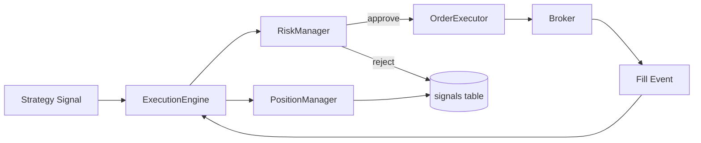

# Order Flow

This document describes how a strategy signal turns into persisted fills and trades.

## Flow Summary

## Signal Model (runtime)

Signals are created from strategy code and include:

- `symbol`
- `side` (`buy`/`sell`)
- `entry_price`
- `stop_price`
- `target_price`
- `strategy`
- `generated_at`
- `correlation_id`
- `regime_tags` / `regime_confidence`
- optional `meta` and `feature_snapshot`

Reference: `src/core/domain.py` (`Signal` dataclass).

## Processing Steps

1. Strategy emits `Signal` from `on_bar()`.
2. ExecutionEngine validates with RiskManager.
3. Signal is persisted with accept/reject context.
4. Approved signal becomes `OrderIntent`.
5. OrderExecutor submits to broker (or noop/backtest executor).
6. Fill/trade updates are normalized and routed back.
7. PositionManager updates open position and realizes PnL on exits.
8. Fill/order/trade rows are persisted to SQLite.

## Rejections

Common rejection classes:

- max positions exceeded
- daily loss/risk constraints
- invalid sizing/notional checks
- strategy/session hard-stop constraints

Rejected signals are still persisted for analytics.

## Correlation IDs

`correlation_id` is required for cross-module traceability:

- generated by strategy signal helper when absent
- propagated into order intents and persisted order/fill/trade records

## Backtest Behavior

Backtests use `BacktestOrderExecutor`:

- deterministic fill model
- configurable partial fill/slippage/spread modes
- optional strict session flatten behavior

References:
- `src/backtest/runner.py`
- `src/backtest/mock_executor.py`
