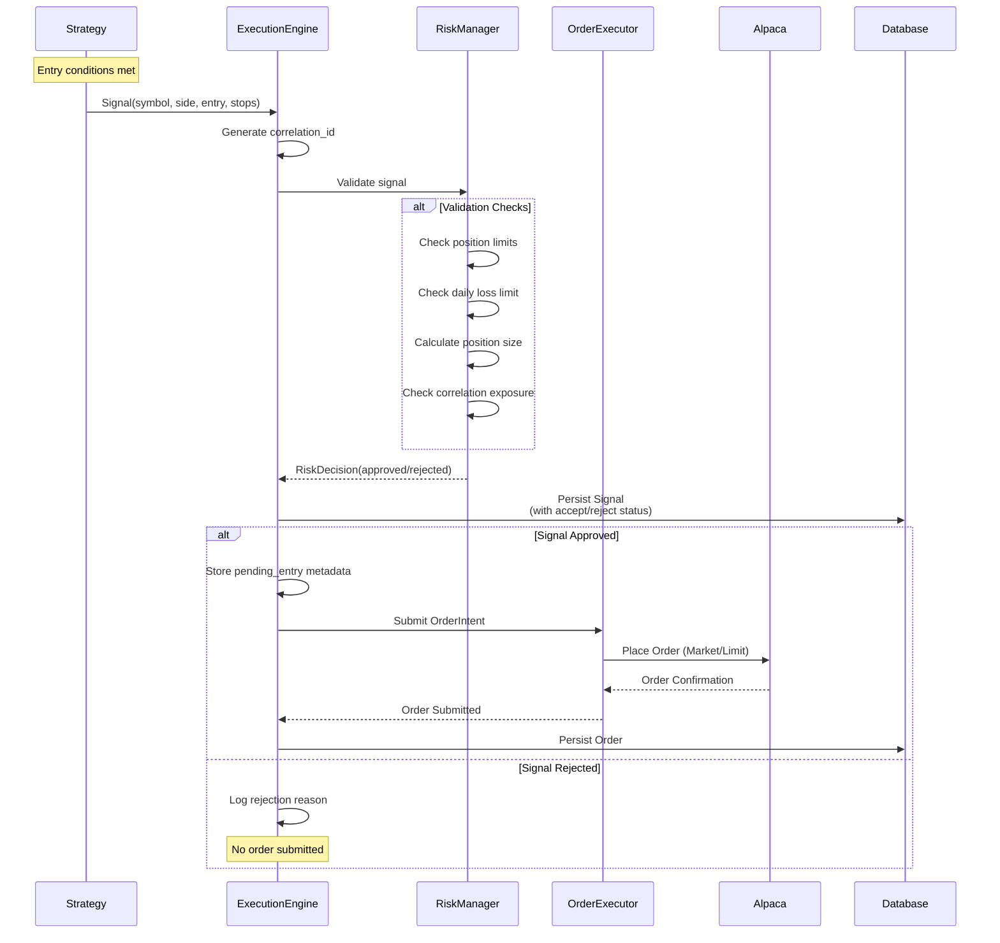
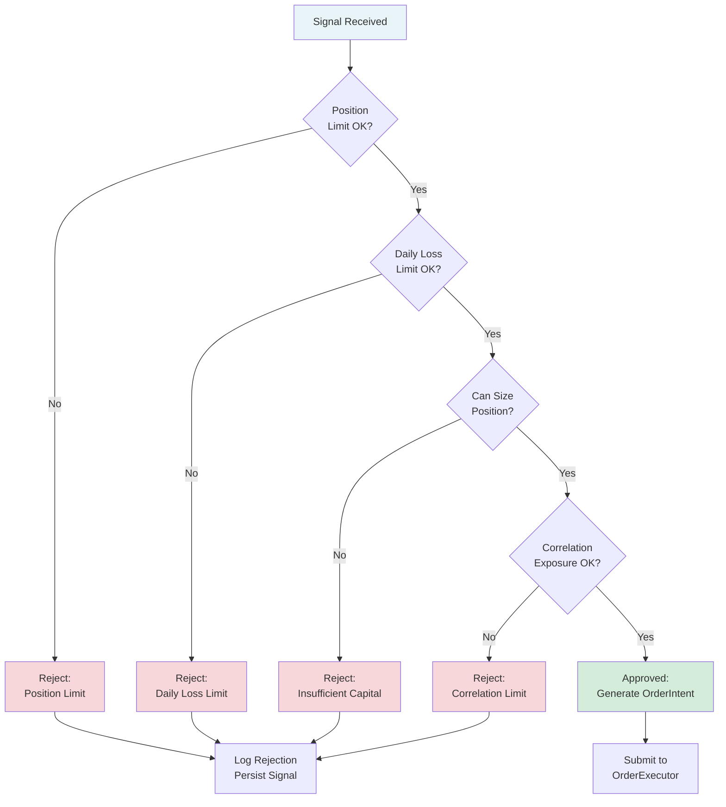
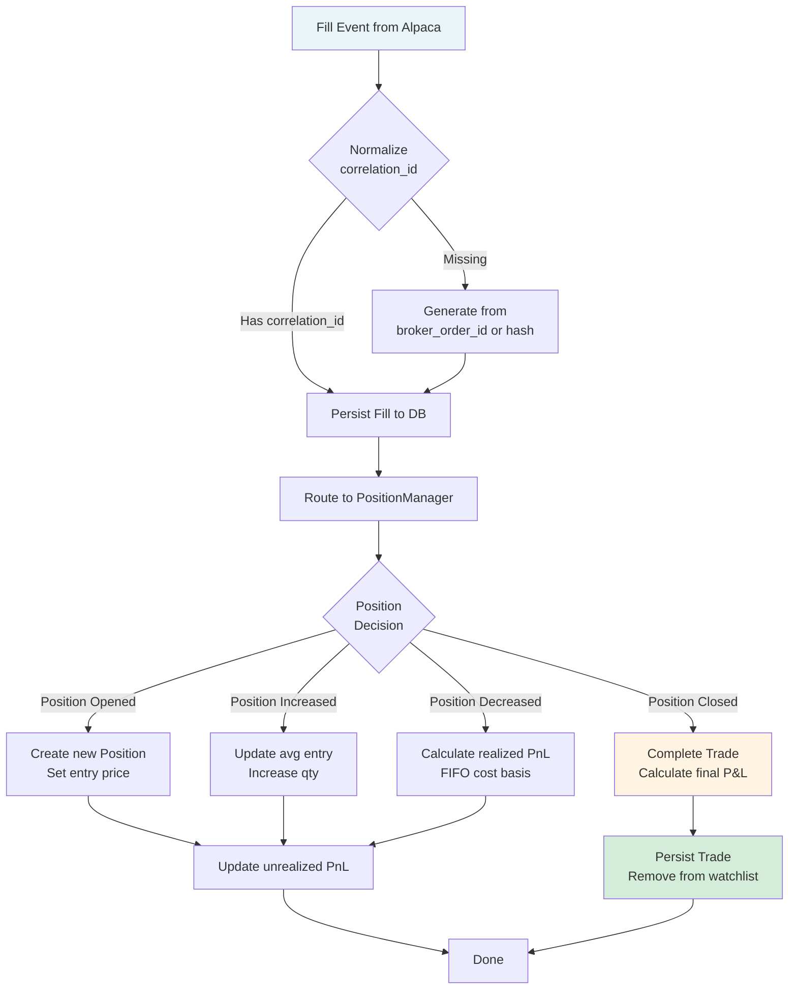
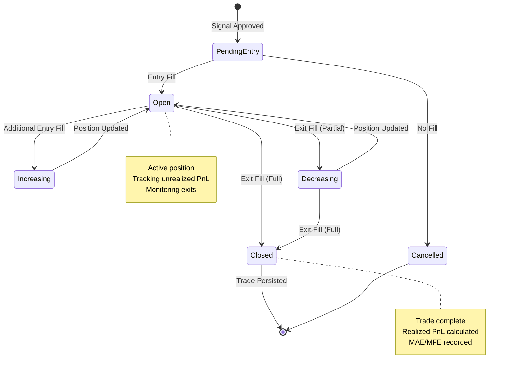
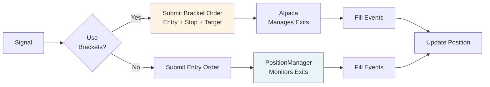

# Order Execution Flow

Detailed workflow from signal generation to trade completion.

## Table of Contents

- [Overview](#overview)
- [Signal-to-Order Flow](#signal-to-order-flow)
- [Risk Check Decision Tree](#risk-check-decision-tree)
- [Fill Processing Workflow](#fill-processing-workflow)
- [Position Lifecycle](#position-lifecycle)

---

## Overview

The order execution flow represents the critical path from strategy signal generation to completed trade. Every signal goes through multiple validation stages before becoming an order, and every fill updates position state.

**Key Components**:
1. **Signal Generation**: Strategies emit signals when entry conditions met
2. **Risk Validation**: RiskManager applies pre-trade checks
3. **Order Submission**: OrderExecutor places orders with broker
4. **Fill Processing**: PositionManager updates positions on fills
5. **Trade Completion**: Trade persisted when position closed

---

## Signal-to-Order Flow

### Complete Sequence



### Signal Structure

```python
@dataclass
class Signal:
    symbol: str
    side: str  # "buy" or "sell"
    entry_price: float
    stop_loss: Optional[float]
    take_profit: Optional[float]
    strategy: str
    correlation_id: str  # Auto-generated
    size_hint: Optional[int]
    features: Optional[dict]
    timestamp: datetime
```

### Risk Decision Factors

1. **Position Limits**: Max positions per symbol, total positions
2. **Daily Loss**: P&L today vs configured limit
3. **Position Sizing**: ATR-based, respects account risk %
4. **Correlation**: Exposure across correlated symbols

---

## Risk Check Decision Tree



### Rejection Reasons (Logged for Analytics)

- `position_limit`: Max positions per symbol exceeded
- `global_position_limit`: Total open positions exceeded
- `daily_loss_limit`: Daily P&L below threshold
- `insufficient_capital`: Cannot size position with available capital
- `correlation_limit`: Exposure to correlated symbols too high
- `invalid_signal`: Missing required fields or invalid values

---

## Fill Processing Workflow

### Fill Event to Position Update



### Fill Decision Logic

**Position Increase** (adding to position):
- Same side as existing position
- Updates average entry price (weighted)
- Recalculates unrealized PnL

**Position Decrease** (partial or full exit):
- Opposite side from existing position
- Calculates realized PnL using FIFO cost basis
- If qty reaches zero → Position Closed

**Example**:
```
1. BUY 100 shares @ $50 → Position: +100 @ $50
2. BUY 50 shares @ $52  → Position: +150 @ $50.67 (weighted avg)
3. SELL 75 shares @ $54 → Position: +75 @ $50.67, Realized P&L: +$250
4. SELL 75 shares @ $55 → Position: 0, Realized PnL: +$325, Trade Complete
```

---

## Position Lifecycle

### State Diagram



### Exit Triggers

**1. Stop Loss Hit**:
- Price crosses stop level
- PositionManager triggers exit signal
- Market order submitted for full position

**2. Take Profit Hit**:
- Price crosses target level
- PositionManager triggers exit signal
- Limit order submitted (or market if aggressive)

**3. Time-Based Exit**:
- Max hold time reached (configured per strategy)
- Market order submitted for full position

**4. End-of-Day Flatten**:
- 15:55 ET (configurable)
- All positions closed via `flatten_all()`
- All pending orders cancelled

**5. Risk Breach**:
- Daily loss limit hit
- Emergency `flatten_all()` triggered
- Trading halted until next day

---

## Trade Metrics Captured

### On Trade Completion

```python
@dataclass
class ClosedTradeInfo:
    symbol: str
    strategy: str
    correlation_id: str
    entry_time: datetime
    exit_time: datetime
    entry_price: float
    exit_price: float
    qty: float
    side: str  # "long" or "short"
    pnl_dollars: float
    pnl_r_multiple: float  # P&L / initial risk
    mae: float  # Maximum Adverse Excursion
    mfe: float  # Maximum Favorable Excursion
    exit_reason: str  # "stop", "target", "time", "eod", "manual"
    hold_duration_seconds: int
```

### R-Multiple Calculation

```
Initial Risk = Entry Price - Stop Loss (for longs)
R-Multiple = Actual P&L / Initial Risk

Example:
  Entry: $50, Stop: $49, Exit: $52
  Risk: $1/share
  P&L: $2/share
  R-Multiple: 2.0 (a "2R" winner)
```

---

## Order Types and Bracket Orders

### Order Types Supported

1. **Market Orders**: Immediate execution at current price
   - Used for: Entries, stops, EOD flatten
   
2. **Limit Orders**: Execution at specified price or better
   - Used for: Profit targets, scale-ins

3. **Bracket Orders**: Entry + stop + target in one order (optional)
   - PRD 6.7: Can delegate exit management to broker
   - If enabled, PositionManager doesn't monitor local exits

### Bracket Order Flow



**Configuration**:
```yaml
use_bracket_orders: true  # Delegate exits to broker
```

---

## Error Handling

### Order Submission Failures

**Scenarios**:
- Insufficient buying power
- Symbol not tradable
- Market closed
- Broker rejection

**Handling**:
- Log error with full context
- Increment error counter
- Do not retry (prevents cascading failures)
- Signal marked as failed in database

### Fill Processing Failures

**Scenarios**:
- Unknown symbol (fill for non-watchlist symbol)
- Database write failure
- Invalid fill data

**Handling**:
- Position state always updated (source of truth)
- Database write failures logged but don't block trading
- Unknown symbols logged as warning

---

## Performance Considerations

### Latency Budget

**Target**: Signal → Order submission ≤ 100ms

**Breakdown**:
- Risk check: ≤ 20ms
- DB write (async): Non-blocking
- Order API call: ≤ 50ms
- Overhead: ≤ 30ms

**Optimizations**:
- Risk calcs cached where possible
- Database writes buffered/async
- Minimal logging on hot path

### Concurrency

**Single-threaded design** for simplicity and determinism:
- All bar processing sequential
- No race conditions on position state
- Easier to reason about and debug

---

## Related Documentation

- [System Architecture](file:///Users/jacobmcmillan/Empire/Cerberus/docs/architecture.md) - Overall system design
- [Strategy Development Guide](file:///Users/jacobmcmillan/Empire/Cerberus/docs/strategy_guide.md) - Creating custom strategies
- [Risk Manager Documentation](file:///Users/jacobmcmillan/Empire/Cerberus/src/engine/risk.py) - Risk check implementation
