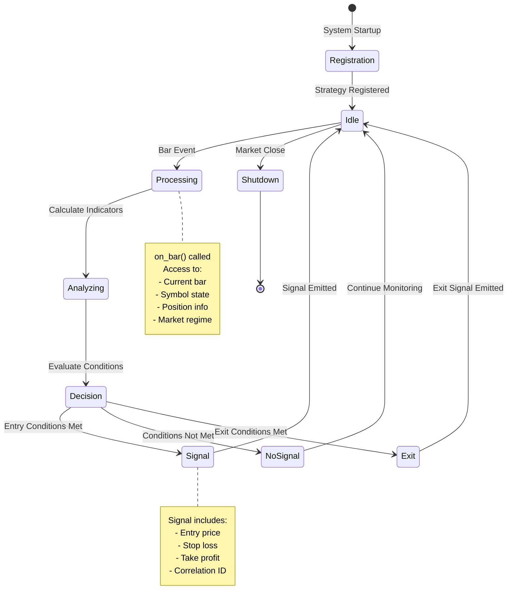
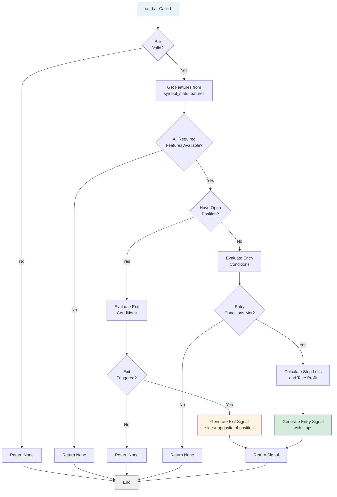
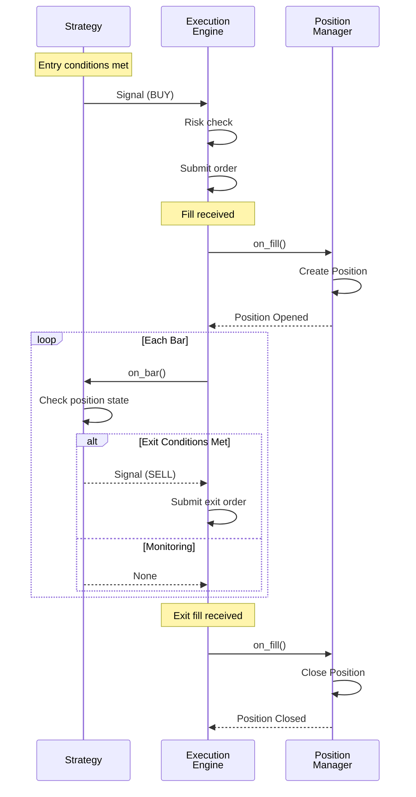

# Strategy Development Guide

How to create custom trading strategies for the Cerberus system.

## Table of Contents

- [Overview](#overview)
- [Strategy Lifecycle](#strategy-lifecycle)
- [Creating a Custom Strategy](#creating-a-custom-strategy)
- [on_bar() Processing Flow](#on_bar-processing-flow)
- [Position Management](#position-management)
- [Testing Strategies](#testing-strategies)

---

## Overview

Strategies in Cerberus are **stateless classes** that analyze market data and emit signals when entry/exit conditions are met. All state lives in `SymbolState` objects managed by the ExecutionEngine.

**Key Concepts**:
- Strategies extend `BaseStrategy` abstract class
- Called for each bar on each symbol in watchlist
- Return `Signal` objects when conditions met
- Can be regime-specific (bull/bear/neutral/volatile)
- Declare feature dependencies for automatic calculation

---

## Strategy Lifecycle

###State Diagram



### Lifecycle Phases

**1. Registration** (Startup):
- Strategy instantiated from config.yaml
- Registered with StrategyEngine
- Feature dependencies noted

**2. Bar Processing** (Runtime):
- `on_bar()` called for each symbol on each bar
- Strategy evaluates entry/exit conditions
- Optionally emits Signal

**3. Shutdown** (EOD):
- No special cleanup needed (stateless design)
- Positions managed by PositionManager

---

## Creating a Custom Strategy

### Step 1: Define Strategy Class

```python
from src.strategies.base import BaseStrategy
from src.core.domain import Signal, SymbolState, MarketState
from typing import Optional

class MyCustomStrategy(BaseStrategy):
    """
    Custom strategy: Enter on [condition], exit on [condition].
    
    Entry: [describe entry logic]
    Exit: [describe exit logic]
    """
    
    # Declare feature dependencies
    FEATURES = ["vwap", "atr", "rsi"]
    
    def __init__(self, config: Optional[dict] = None):
        self.config = config or {}
        # Extract strategy-specific params
        self.rsi_threshold = self.config.get("rsi_threshold", 70)
        self.atr_multiplier = self.config.get("atr_multiplier", 2.0)
```

### Step 2: Implement on_bar()

```python
    def on_bar(
        self,
        symbol_state: SymbolState,
        market_state: MarketState
    ) -> Optional[Signal]:
        """
        Evaluate conditions and optionally emit signal.
        
        Args:
            symbol_state: Current symbol data and position
            market_state: Market regime and timestamp
            
        Returns:
            Signal if entry/exit conditions met, None otherwise
        """
        # Get current bar and features
        bar = symbol_state.last_bar
        if bar is None:
            return None
            
        features = symbol_state.features or {}
        vwap = features.get("vwap")
        atr = features.get("atr")
        rsi = features.get("rsi")
        
        # Require all features available
        if None in (vwap, atr, rsi):
            return None
        
        # Check if we have an open position
        pos = symbol_state.position
        
        # EXIT LOGIC (if in position)
        if pos is not None and pos.qty > 0:
            # Example: Exit if RSI crosses back below threshold
            if rsi < self.rsi_threshold - 10:
                return Signal(
                    symbol=symbol_state.symbol,
                    side="sell",  # Exit long
                    entry_price=bar.close,
                    strategy=self.__class__.__name__,
                )
        
        # ENTRY LOGIC (if not in position)
        if pos is None or pos.qty == 0:
            # Example: Enter long if price above VWAP and RSI overbought
            if bar.close > vwap and rsi > self.rsi_threshold:
                stop_loss = bar.close - (atr * self.atr_multiplier)
                take_profit = bar.close + (atr * self.atr_multiplier * 2)
                
                return Signal(
                    symbol=symbol_state.symbol,
                    side="buy",
                    entry_price=bar.close,
                    stop_loss=stop_loss,
                    take_profit=take_profit,
                    strategy=self.__class__.__name__,
                )
        
        return None  # No signal
```

### Step 3: Add to Configuration

```yaml
# config.yaml

strategies:
  my_custom_strategy:
    enabled: true
    rsi_threshold: 70
    atr_multiplier: 2.0
    regimes:
      bull: true
      bear: false
      neutral: true
      volatile: false

strategy_routing:
  default: ["my_custom_strategy"]
  bull: ["my_custom_strategy", "vwap_momentum"]
  bear: []
  neutral: ["my_custom_strategy"]
  volatile: []
```

### Step 4: Register in StrategyEngine

```python
# src/main.py or wherever StrategyEngine is initialized

from src.strategies.my_custom_strategy import MyCustomStrategy

# In strategy initialization
strategies_config = config.get("strategies", {})
custom_config = strategies_config.get("my_custom_strategy", {})

if custom_config.get("enabled", False):
    strategy = MyCustomStrategy(config=custom_config)
    strategy_engine.register_strategy("my_custom_strategy", strategy)
```

---

## on_bar() Processing Flow

### Complete Workflow



### Best Practices

**1. Always Validate Inputs**:
```python
if bar is None or symbol_state.features is None:
    return None
```

**2. Check Feature Availability**:
```python
required_features = ["vwap", "atr", "rsi"]
if any(symbol_state.features.get(f) is None for f in required_features):
    return None
```

**3. Use ATR for Stop/Target Calculation**:
```python
atr = symbol_state.features["atr"]
stop_loss = entry_price - (atr * 2.0)  # 2 ATR stop
take_profit = entry_price + (atr * 3.0)  # 3 ATR target (1.5R)
```

**4. Respect Existing Positions**:
```python
# Don't emit entry signals if already in position
if symbol_state.position and symbol_state.position.qty > 0:
    # Only evaluate exits
    pass
```

---

## Position Management

### Position Lifecycle from Strategy Perspective



### Accessing Position State

```python
def on_bar(self, symbol_state: SymbolState, market_state: MarketState):
    pos = symbol_state.position
    
    if pos is None:
        # No position
        pass
    elif pos.qty > 0:
        # In position
        entry_price = pos.avg_price
        unrealized_pnl = pos.unrealized_pnl
        side = pos.side  # PositionSide.LONG or SHORT
    
    # Access MAE/MFE for position management
    mae = pos.mae if pos else 0.0  # Max adverse excursion
    mfe = pos.mfe if pos else 0.0  # Max favorable excursion
```

### Exit Strategies

**1. Stop Loss** (ATR-based):
```python
if pos and bar.close <= pos.avg_price - (atr * 2.0):
    return Signal(symbol=symbol, side="sell", entry_price=bar.close, strategy=self.name)
```

**2. Take Profit** (ATR-based):
```python
if pos and bar.close >= pos.avg_price + (atr * 3.0):
    return Signal(symbol=symbol, side="sell", entry_price=bar.close, strategy=self.name)
```

**3. Time-Based Exit**:
```python
if pos:
    hold_duration = (market_state.time - pos.entry_time).total_seconds()
    max_hold_seconds = 3600  # 1 hour
    if hold_duration > max_hold_seconds:
        return Signal(symbol=symbol, side="sell", entry_price=bar.close, strategy=self.name)
```

**4. Trailing Stop** (using MAE):
```python
if pos and pos.mfe > atr * 2.0:  # Been profitable
    # Trail stop to break-even once 2 ATR profit achieved
    if bar.close <= pos.avg_price:
        return Signal(symbol=symbol, side="sell", entry_price=bar.close, strategy=self.name)
```

---

## Testing Strategies

### Unit Testing

```python
# tests/unit/test_my_custom_strategy.py

import pytest
from src.strategies.my_custom_strategy import MyCustomStrategy
from src.core.domain import SymbolState, MarketState, Bar
from datetime import datetime, timezone

def test_entry_signal_generated():
    """Test that entry signal generated when conditions met."""
    strategy = MyCustomStrategy(config={"rsi_threshold": 70, "atr_multiplier": 2.0})
    
    # Setup symbol state with bar and features
    symbol_state = SymbolState(symbol="AAPL")
    symbol_state.last_bar = Bar(
        symbol="AAPL",
        timestamp=datetime.now(timezone.utc),
        open=100.0,
        high=101.0,
        low=99.0,
        close=100.5,
        volume=1000000
    )
    symbol_state.features = {
        "vwap": 99.0,  # Price above VWAP
        "atr": 1.0,
        "rsi": 75.0   # RSI overbought
    }
    symbol_state.position = None  # No position
    
    market_state = MarketState(regime="bull", time=datetime.now(timezone.utc))
    
    # Execute
    signal = strategy.on_bar(symbol_state, market_state)
    
    # Assert
    assert signal is not None
    assert signal.side == "buy"
    assert signal.symbol == "AAPL"
    assert signal.stop_loss is not None
    assert signal.take_profit is not None

def test_no_signal_when_features_missing():
    """Test that no signal generated when features unavailable."""
    strategy = MyCustomStrategy()
    
    symbol_state = SymbolState(symbol="AAPL")
    symbol_state.last_bar = Bar(...)  # Valid bar
    symbol_state.features = {"vwap": 100.0}  # Missing ATR, RSI
    
    signal = strategy.on_bar(symbol_state, MarketState())
    
    assert signal is None
```

### Backtesting

```bash
# Run backtest for your strategy
python scripts/run_backtest.py \
    --config config/backtest_my_strategy.yaml \
    --start 2024-01-01 \
    --end 2024-12-31 \
    --symbols AAPL,MSFT,GOOGL
```

**Backtest Configuration**:
```yaml
# config/backtest_my_strategy.yaml
strategies:
  my_custom_strategy:
    enabled: true
    rsi_threshold: 70
    atr_multiplier: 2.0

risk:
  max_position_size_pct: 0.10  # 10% of capital per position
  max_daily_loss_pct: 0.02     # 2% daily loss limit
```

---

## Common Patterns

### Pattern 1: Mean Reversion
```python
# Enter when price far from VWAP, exit when reverts
if not pos:
    vwap_dev = (bar.close - vwap) / vwap
    if vwap_dev < -0.02:  # 2% below VWAP
        return Signal(side="buy", ...)
elif pos:
    if bar.close >= vwap:  # Reverted to VWAP
        return Signal(side="sell", ...)
```

### Pattern 2: Momentum Breakout
```python
# Enter on breakout above resistance, exit on support break
high_of_day = features.get("high_of_day")
if not pos and bar.close > high_of_day:
    return Signal(side="buy", ...)
elif pos and bar.close < vwap:
    return Signal(side="sell", ...)
```

### Pattern 3: Failed Pattern Fade
```python
# Enter when breakout fails, exit on continuation
if not pos:
    if bar.high > high_of_day and bar.close < high_of_day:
        # Failed breakout
        return Signal(side="sell", ...)  # Short
elif pos and pos.side == PositionSide.SHORT:
    if bar.close > pos.avg_price + atr:
        return Signal(side="buy", ...)  # Cover short
```

---

## Feature Dependencies

### Declaring Dependencies

```python
class MyStrategy(BaseStrategy):
    FEATURES = ["vwap", "atr", "rsi", "bollinger_upper", "bollinger_lower"]
```

### Available Features

See [`src/data/features.py`](file:///Users/jacobmcmillan/Empire/Cerberus/src/data/features.py) for complete list:

- **Price**: `vwap`, `high_of_day`, `low_of_day`, `open`, `pivots`
- **Volatility**: `atr`, `bollinger_upper`, `bollinger_lower`, `std_dev`
- **Momentum**: `rsi`, `roc` (rate of change), `momentum`
- **Volume**: `volume_profile`, `vwap_deviation`

---

## Debugging Strategies

###Enable Debug Logging

```python
import logging

class MyStrategy(BaseStrategy):
    def __init__(self, config=None):
        self.logger = logging.getLogger(self.__class__.__name__)
        self.logger.setLevel(logging.DEBUG)
    
    def on_bar(self, symbol_state, market_state):
        self.logger.debug(
            "Evaluating %s: close=%.2f, vwap=%.2f, rsi=%.1f",
            symbol_state.symbol,
            symbol_state.last_bar.close,
            symbol_state.features.get("vwap"),
            symbol_state.features.get("rsi")
        )
        # ... strategy logic
```

### Common Issues

**1. Features Always None**:
- Verify `FEATURES` class attribute declared
- Check FeatureCalculator has enough historical data
- Ensure feature names match exactly

**2. Signals Not Generating Orders**:
- Check risk limits (position limit, daily loss)
- Verify signal structure (all required fields)
- Check logs for rejection reasons

**3. Positions Not Closing**:
- Ensure exit signals have correct side (opposite of entry)
- Verify PositionManager receiving fill events
- Check bracket order configuration

---

## Related Documentation

- [System Architecture](file:///Users/jacobmcmillan/Empire/Cerberus/docs/architecture.md) - Overall system design
- [Order Execution Flow](file:///Users/jacobmcmillan/Empire/Cerberus/docs/order_flow.md) - Signal to trade workflow
- [BaseStrategy API](file:///Users/jacobmcmillan/Empire/Cerberus/src/strategies/base.py) - Strategy interface
- [Example Strategies](file:///Users/jacobmcmillan/Empire/Cerberus/src/strategies/) - Reference implementations
